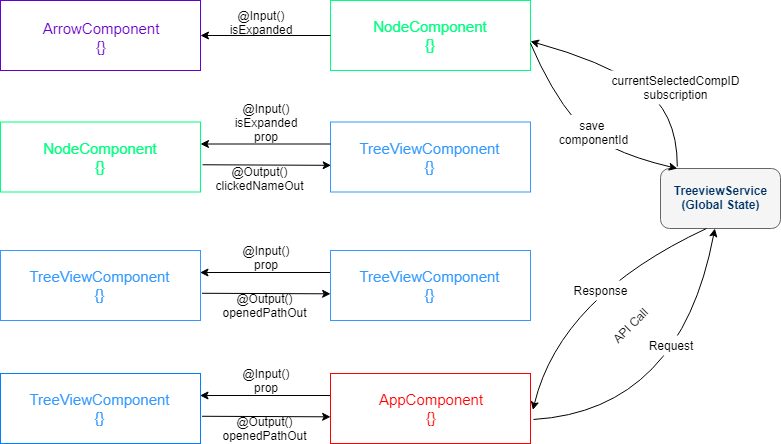

# OpenapiExplorer


This project allows user to view all possible endpoints and data strutures as described in a given OpenAPI specification. The corresponding dynamically generated tree struture should allow users to select nodes within, as wellas display wat is currently selected textually.
## Project Structure
To be able to parse open api file, [API DevTools](https://github.com/APIDevTools/swagger-parser) is used with version 10.0.2.
### 1. Frontend
Frontend was generated with [Angular CLI](https://github.com/angular/angular-cli) version 11.0.1.
Precondition: this application accepts only valid open api `*.yaml`  file.
#### Development server
Run `cd frontend` and `ng serve` for a dev server. Navigate to `http://localhost:4200/`. The app will automatically reload if you change any of the source files.
#### Build
Run `ng build` to build the project. The build artifacts will be stored in the `dist/` directory. Use the `--prod` flag for a production build.
#### Running unit tests
Run `ng test` to execute the unit tests via [Karma](https://karma-runner.github.io).
#### Application

##### Example look


##### Application Components


### 2. Backend
Backend was generated with [Express JS](https://expressjs.com/) version 4.17.1.
It serves an api to parse selected file. 
#### Development server
Run `cd backend` and `npm run server` for a dev server. Navigate to `http://localhost:3000`. The app will automatically reload if you change any of the source files.
#### Api Endpoints
##### 1. Parse selected file
###### POST <api version>/parser/swaggerparser
###### Request Payload
    filecontent: "openapi: 3.0.1
    ↵info:
    ↵  title: "Example Profile"
    ↵  version: "0.0.1"
    ↵servers:
    ↵  - url: "{location}/mock-profile"
    ↵    variables:
    ↵      location:
    ↵        default: http://localhost
    ↵paths:
    ↵  /random-number:
    ↵    get:
    ↵      summary: "Get a random number in the range 0-1"
    ↵      responses:
    ↵        200:
    ↵          content:
    ↵            application/json:
    ↵              schema:
    ↵                type: object
    ↵                properties:
    ↵                  random: 
    ↵                    type: number"
###### Response
    [{"name":"random-number","type":"endpoint","properties":{"random":{"type":"number"}}}]

#### File Structure
```
root
│   README.md
│   .gitignore    
│
└───frontend
│   │   angular.json
│   │   package.json
│   │   ...
│   │   
│   └───e2e
│   │   
│   └───src
│       │   favicon.ico
│       │   index.html
│       │   style.css
│       │   ...
│       │   
│       └─── app
|       |    |  app.components.css/html/spec.ts/ts
|       |    |  app.module.ts
│       |    └─── components
│       |    |    └─── arrow
│       |    |    └─── node
│       |    |    └─── treeview
│       |    |    
│       |    └─── models
│       |    |    | model.ts
│       |    |    
│       |    └─── service
│       |         | apiconfig.ts
│       |         | treeview.service.ts/spec.ts
│       |  
│       └─── assets
|       |      |  expanded_arrow_icon.svg
|       |      |  openapi_icon.svg
|       |    
│       └─── environments
|       |
│       └─── services
│             | swaggerservice.ts
│   
└───backend
│   │   app.js
│   │   package-lock.json
│   │   package.json
│   │   
│   └───api
|   |   |   index.js
│   │   └───v1.0
│   │       │   index.js     
│   │   
│   └───services
|       └───parserservice
|           │   swagger.js     
```

### How to test the application with your files?
#### 1) Only with Frontend
There is a variable in `app.component.ts` called `isBackendActive` to test application with static files.Its value should be changed with false. Target `yaml` file should be located under `/frontend/src/` and then name of the file should be given to `apiFileName` in `app.component.ts` as value.
So:

    isBackendActive = true;
    ..
    ..
    const apiFileName = 'my-test-file.yaml';
    ..

#### 2) With frontend and backend
This is easiest way to test the application. Only thing to do is choosing target .yaml file through file chooser on gui.